   

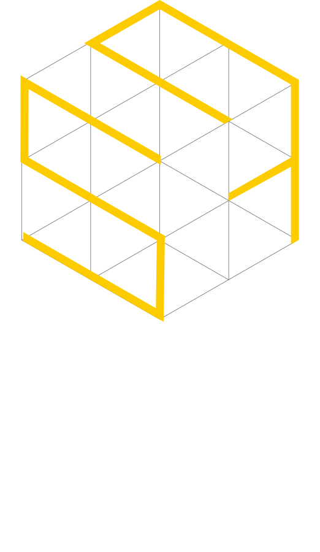

   

# **White Paper**

   

# **1. Outline** 
Blockchain technology, which emerged from its use in the security and financial markets, has begun to be used and applied in various industries such as society, culture, and distribution beyond the economic sector. The industry is actively progressing without restrictions between countries or companies. In construction and material distribution, we would like to contribute to resolving inconveniences through efficient and effective operation through blockchain technology, expanding the area of related industries, and increasing value by introducing new technologies.  

Currently, our world is amid the popularization of credit cards, the expansion of online banking, the growth of e-commerce and the digital economy, the speed of rapid development in the financial sector through the use of blockchain, and the era of Ontact (Ontact, Online + Untact) beyond the era of Untact. And the market is evolving and developing, entering the global online era of education, culture, and distribution markets. Blockchain is expected to generate hundreds of billions of dollars in sales in this recent market trend as it encounters big data and prepares solidly for upgrading the entire market.  
 
On the other hand, it is not keeping up with the pace of development in the domestic construction sector. Even though various services such as blockchain and big data are becoming more active in all industries, O2O platform services are just now preparing to enter the construction market. It is no exaggeration to say that the pace of development is only in its infancy.  
 
In the case of previous industries, if they are striving to resolve the facts, transparency, and security of information, it was difficult to confirm whether the provider's information was true from the user's point of view, regardless of whether it was in good faith or not. Regardless of whether it is true, it was also difficult for users to accept the information provided transparently. This was because information could be manipulated at any time, and disclosure could be controlled. As such, there were many shortcomings in reliability.  
This was the same in the security area.  
Starting with the construction sector's raw material distribution service platform, Consight aims to help reduce unnecessary activity costs by providing the necessary information easily within one platform and utilizing the transparency and reliability of data through the blockchain. In addition, we would like to preoccupy the market through unique and special services and further promote the rapid development of the construction industry.

 
 

# **2. Construction market**
 

## **2.1 Market Status**
Among the domestic construction markets, the construction market is 116.6 trillion won(KRW) in 2019, 149.4 trillion won in 2020, and 161.2 trillion won in 2021. In the case of the civil engineering market, it continues to increase every year to 49.5 trillion won in 2019, 44.7 trillion won in 2020, and 53.2 trillion won in 2021. According to data released last November by the Korea Construction Association, the outlook for construction orders in 2022 is also expected to rise 0.2% year-on-year to 214.8 trillion won.
 

### 2.1.1 Construction materials market
 

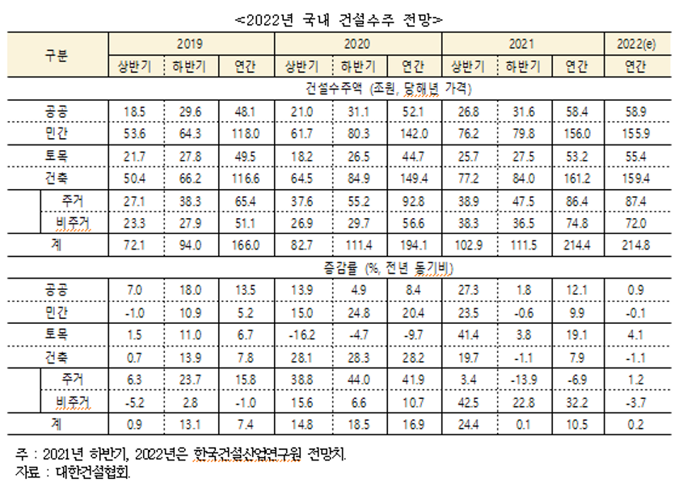

  

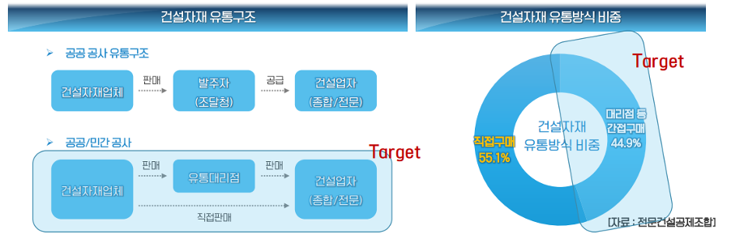

  
Direct purchases accounted for about 55.1% of construction materials distribution by public/private corporations. In the case of comprehensive(complete) construction, companies often purchase major materials such as structural materials, except for payment materials supplied by the client and finishing materials directly procured by specialized companies. Professional construction companies generally purchased and procured materials exceeding basic designs and plans. In the case of small and medium-sized comprehensive construction companies with weak price bargaining power, material costs are included in subcontracting so that professional construction companies can purchase them directly.
  

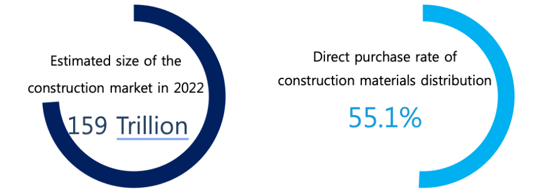

  

### 2.1.2 Mobile commerce & O2O service market trends  
Mobile 2.3 Commerce and O2O Service Market Trends for Online/Offline Commerce in Various Fields
It is a trend to use the platform environment. The mobile commerce and platform service market has grown to 4.7825 trillion won in 2020 due to smartphones' high penetration and convenience. The O2O service market, which connects online and offline, has also increased from 2.2147 trillion won in 2018 to 3.3179 trillion won in 2020. The construction market also requires a mobile platform for various trading convenience environments. Users familiar with existing services are expected to participate in the platforms for construction-related products and services if the environment is provided.

  

## **2.2 Market prospect**
The direct supply and distribution structure of construction materials is expected to gradually increase in the construction market, accounting for a large portion of the construction market. However, the construction material market is still necessary to solve some problems such as arrears and a new business environment. As the mobile commerce and O2O service market and the blockchain market are rapidly growing through the spread of smartphone penetration and technology development, it is believed that there will be a way to solve the previous problems in the construction market's services.
   

# **3. Consight(CST) Soluction**
 

## **3.1 Consight(CST) Outline**  
The Consight ecosystem consists of "Consight," a construction information platform service, and "Group Purchase for moving in," a group purchase site for prospective residents. Using big data, the process estimation module activates the service by allowing Consight's primary customer, construction material suppliers, to reduce operating costs, improve efficiency, and enable the general public to participate in the platform. Meanwhile, in the case of the Group Purchase for the Residence market, there is a market environment unfavorable to prospective tenants due to monopolization and information uncertainty. Consight constructs an ecosystem that can benefit both service providers and users through blockchain technology and token economy. 
  

## **3.2 Consight**  
### 3.2.1 Consight - Consight token(CST)  
The core of the construction information platform service "Consight" is securing data. From the constructor's point of view, it should be helpful to update the construction site information in charge of construction. The information should be reliable as a supplier. The risk of delinquency in material delivery should be eliminated after delivery through information. On top of that, for appropriate information to be updated steadily, data monitoring by third parties, not stakeholders, must also be possible. Therefore, Consight solves the problem by introducing the CST token economy and the NFT concept.  

In the Consight ecosystem, CST tokens are utility tokens used to pay in the construction notification app. Suppliers who want to check construction information can check construction information through the platform using CST tokens. In addition, the payment and settlement of construction materials will be made possible with CST tokens.
  

[ The photo of 'the construction notification' (Consight) app service ]

  
The construction information update, which is the basis of the 'consight’ service, begins with the registration of the NFT pool, which will be described later. Construction companies, the core subject of construction information registration, can create NFC pools. Whenever they update basic construction information such as building use, floor area ratio, building coverage ratio, construction date, ground floor count, and the total floor area, CST tokens will be given from the platform. The end-users can also participate in creating NFT pools and updating construction information. CST token reward can be obtained through new construction site registration and information update for end-users. An additional reward is obtained if the general user filters falsely registered construction information.
  

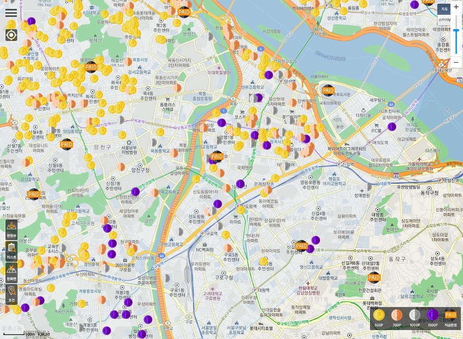

[ Picture of CST token reward service in the Consight app ]

  
Such registration of construction information by general users and constructors and the resulting token economy of 'Consight' will allow construction status information from all over the country to be registered in a reliable form. It will make the Consight platform more advantageous in securing data.
  

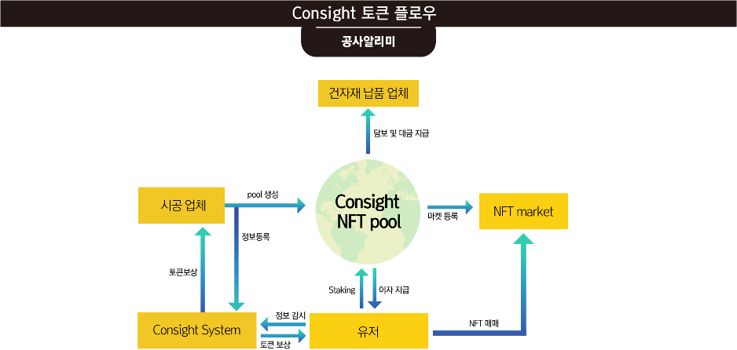

[ Data flow diagram ]

  

### 3.2.2 Consight - Consight NFT pool  
If the above-described construction information registration and CST as a reward have the nature of utility tokens, Consight's NFC pool was introduced to help constructors supply and demand construction materials more stably and protect suppliers from risks arrears in construction materials. In addition, general users can earn a certain level of interest to contribute to the stable supply and demand of construction materials by participating in the NFT pool with CST tokens.
  

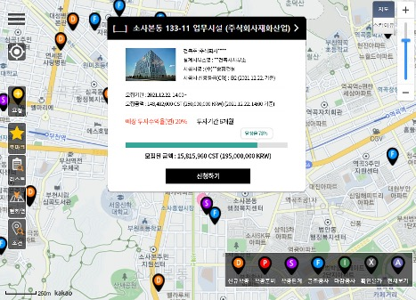

[ Consight - On-site map/virtual building & constructions notation in the app ]

  
First, builders can consume CST tokens to register buildings under construction as NFT pools and establish virtual construction sites within the platform. The NFT pool is established for smooth supply and demand of construction materials and remains until construction is completed. NFT pool can be participated by anyone holding CST tokens. Participants will receive CST tokens upon completion according to the registered interest rate when creating the NFT pool.  

Constructors can reduce the burden of procuring construction materials by forming and disclosing buildings/constructions under construction as NFT pools. In the case of construction material suppliers, the CST token deposited in the NFT pool is accepted as a kind of collateral.  

You can defend yourself against risks such as arrears by delivering materials in a more stable structure. With the completion of the construction, the NFT pool will be terminated, and CST interest will be given to users who participate in the pool according to the known interest rate. With the end of the NFT, the building/constructions will be registered in the NFT market, and the registered NFT can be traded through CST.

  

## **3.3 Group purchase for moving in**  
Another service of the Consight ecosystem, group purchase for moving in, aims to form a group purchase platform for resident apartments. There are necessary items and services such as wall-mounted TV, air conditioner, Internet, and moving-in cleaning when moving into an apartment. There is currently no platform in Korea that provides such information efficiently.   
In some cases, group purchases are made higher through the moving-in fair. The Group Practice for moving in platform can be a service that can solve problems in the current market. Therefore, the Group Practice for Moving-in platform can be a service that can solve problems in the current market.

  

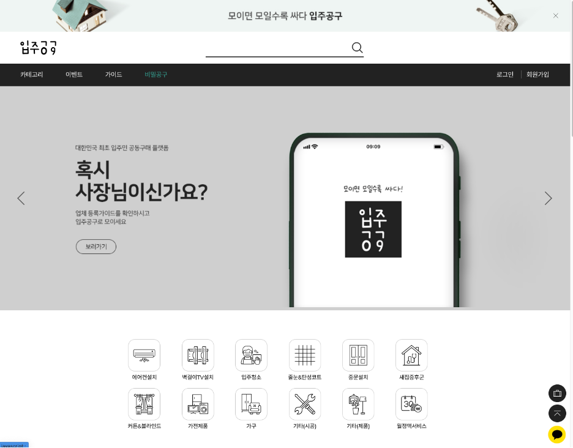

[ The website for group purchase ]

   

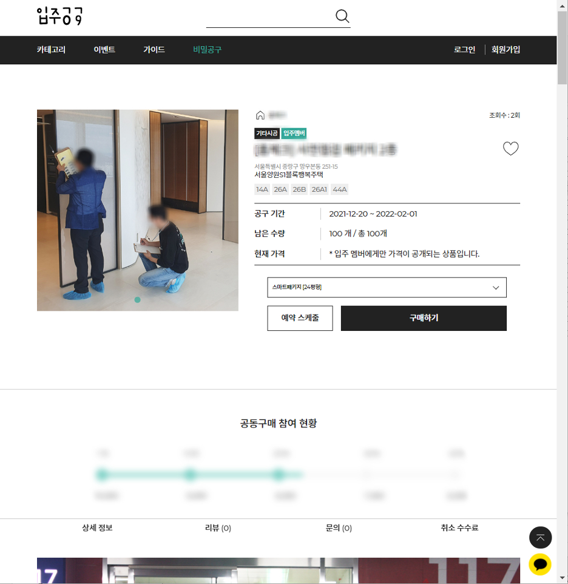

[ The details of the homepage ]

  
CST tokens are used in CONsVERSE (Consight Metaverse), a metaverse worldview within the Group purchase platform for moving in.
  

### 3.3.1  CONsVERSE (Consight Metaverse)  
 
CONsVERSE Platform is an NFT technology-based metaverse platform that utilizes blockchain technology.
CONsVERSE is a metaverse platform for various apartments and local communities. It aims to provide more accessible and convenient spaces for residents by more intuitively and systematically establishing communities divided into Naver cafes, KakaoTalk group chat rooms, and Naver bands for prospective residents.  

The platform can participate in metaverse environments (PCs, mobile devices, VR devices, etc.) with various devices and uses PC's web browser. Using VR equipment, an additional device, you can experience a more realistic metaverse environment. Platform participants can earn rewards through various activities within the platform, and the system is operated to ensure fair rewards are distributed according to the participants' activities and contributions. It provides community participants with a more realistic and realistic space by providing 3D space based on actual measurements. The CONsVERSE Platform consists of four solutions, and the configuration is as follows.  
 
#### 3.3.1.1 Space
The resident community space includes basic chat, video chat, and bulletin board functions and will help you communicate with participants in each community. It is the essential space that participants who first access CONsVERSE see for the first time. Participants who participate in the area can communicate through chat or video chat with other participants, divide groups using the subscription information of the data participants, and provide a primary community space for each group.

* Provide a space for residents  
    It is a community space provided. It is the first space where participants (residents) are moved. You can communicate with other participants in the area by chatting, video chatting, etc.

* Model house
    It is a space to decorate your own model house using 3D modeling data from various apartments. Participants (businesses and individuals) participating in the platform can use the model editor tool to create apartment model houses under multiple conditions. The content of the produced model house can be released in various ways depending on the level of content disclosure by the creators. Buyers (companies) who want the quality of high model house content can directly check the model house content, purchase the content they like, and disclose it to all participants.
 

[ Model house image ]

  

* Vote  
    The main community is voting to find various opinions and agreements occurring in the community space and is introducing a voting system using cafe bulletin boards or Kakao Talk. CONsVERSE introduces blockchain technology to apply this essential voting system within the community to voting. You can use the following general voting functions.

      - Paintwork that all residents did not approve of, service company change, resident representative election, dismissal, etc.
    
    Existing voting systems that are not transparent and inconvenient will be implemented in CONsVERSE for easy use and access. It also encourages residents to participate in the vote by providing CST as a reward for voting. All voting can be recorded on various blockchain platforms with blockchain technology and cannot be forged or altered because it uses this function.  
      
* Bulletin board  
    The resident community space provides community bulletin boards on various topics. Participants can access where the bulletin board is in the area, check the contents of all bulletin boards using the UI, or post content on various topics directly. You can check the contents of multiple issues at any time and directly sponsor and recommend valuable content. Multiple groups or unique resident communities will provide community bulletin boards.

      - Community bulletin boards with various topics
      - Check out easy content with a convenient UI
      - Direct production of bulletin board contents
      - Content recommendation and sponsorship system
 

* Commercial  
    Advertising functions allow companies or individuals to post and send advertisements in the tenant space virtual space created by various groups. In the future, advertisements by space and time will be posted and transmitted through multiple advertisement settings and bids. Some profits from advertising transmission are distributed to the joint assets of each tenant community group.  

    Advertising methods are divided into 1) simple exposure type and 2) quest reward type.  
    Companies (including small business owners) and individuals scheduled to advertise for community participants can use CST to conduct effective advertisements by industry.   
     
    1. Simple exposure advertisement 
       - Simple exposure advertisement refers to an advertisement method displayed in various spaces of each resident community space for a certain period.  
        It supports more effective advertising by selecting various times and total advertisement exposure time.  
     
    2. Quest reward advertisement
        - It is not a general spatial advertisement exposure but an advertisement method that induces direct participation of participants in the Metaverse platform through pop-ups or quest-type alarms. Mainly surveys and customers have more reliable data and advertising effects through advertising methods that collect simple opinions.
  

#### 3.3.1.2 Data Market (Modeling Market)

A data market is a data market that sells and rents 3D modeling data produced by participants. All participants can participate as 3D modeling makers, and 'Consight Metaverse' can use modeling data produced by themselves using the service. In addition, you can sell and lease your data to other participants. All of these modeling data utilize NFT (Non-Fungible Token) technology to protect the value and ownership of the content.  
 
* Sales and lease of 3D models  
  Modelers (Participants: individuals or companies) can register product modeling data in the data market and sell or lease it.  
   
* Advertising bidding service  
  It is an advertising bidding system sent to a community space or virtual model house. The posting period is at least one day and can be up to 30 days. Bidding will be sold in the order of the highest number of CSTs required on the 1st day of posting, and if you give up without permission after the successful bid, your bidding qualification will be limited for up to 6 months.
  

#### 3.3.1.3 Model Editor  
Modelers (Participants: individuals or companies) can create and edit model houses using the basic Model Editor in the Consight Metaverse Platform.
  
#### 3.3.1.4 External System Interface  
It is a system for importing and linking data such as interface system, real estate data, or map information to link data from external systems.

      - Real estate market price: The Ministry of Land, Infrastructure and Transport's actual transaction price disclosure system ( rt.molit.go.kr )
  

### 3.3.2 Platform role

#### 3.3.1.3 Virtual Moving in Fair  

The company purchases CST and produces various booths and advertising devices in the virtual moving-in fair. Whenever residents attend the fair, visit the booth, and check the advertising devices, residents obtain CST. The actual product sale is linked to the group purchase tool site for the residence. By opening a virtual moving in fair, residents can comfortably meet with companies regardless of location.
  

  

#### 3.3.1.4 Community space
Unlike cafes and group chat rooms where active participation is difficult due to indiscriminate personnel composition, it creates a more active purpose (relational) community in apartments. Residents record their profiles (job, gender, age, specialized field, etc.) and run out of CST when they check the profile of the other person they want to talk to or try to chat with.
 

   

# **4. Token**
 

## **4.1 Token Outline**
CST is an Ethereum-based token designed on the Ethereum blockchain. It is used to activate utility tokens for payment payments, NFT pool participation, and CONsVERSE (ConsVERSE) within the Consight platform (construction notification, group purchase tool for residents). Its primary purpose is to revitalize Consight's service ecosystem rather than just payment.   
Ethereum is currently performing critical functions in the entire cryptocurrency ecosystem, including NFT and De-fi, so it was adopted in consideration of the platform's scalability. For Consight's complete roadmap, including NFT and Staking pool modules, Ethereum-based will be the most efficient choice on its long-term vision.

  

## **4.2 Token Function**
The main function of CST is by far a means of exchange for the purchase of various services and goods within the Consight platform. It plays a key role in Consight's service payment on the platform, such as checking construction information across the country, paying for construction materials, and using CONsVERSE (Consight Metaverse) services.   
In addition, general users can register and filter information in the construction notification or group purchase tool service for residents to obtain CST and participate in the NFT pool or use platform services through the acquired CST token.

 

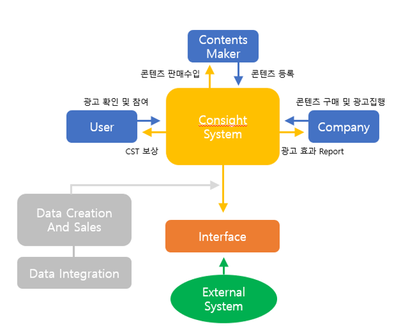

[ The overall token flow structure ]

  

## **4.3 Token Value**  
Consight proposes the following strategies to increase the demand for CST tokens and maintain their value in the following directions.  
 

### 4.3.1 NFT Market
Consight plans to introduce market operations by turning the completed building into NFT. In the future, we plan to focus on enhancing the value of NFT holders by providing various benefits through NFTs, such as service discounts offered by the building and tenant companies. As building-based NFTs and additional benefits centered on them expand, NFT users are expected to increase, and the market will be activated.  
 

### 4.3.2 Consight NFT pool  
The Consight NFT pool is designed to reduce the risk of construction companies with difficulty securing construction materials and suppliers with risk factors such as arrears. When a construction company creates an NFT pool, users can check the interest rate set by the company and deposit the CST token in the pool. The supplier can accept the amount deposited in the NFT pool as collateral. Consight believes that such an NFT pool will become a win-win system for users, contractors, and suppliers.  
  

### 4.3.3 ConsightMetaverse Platform  

In CONsVERSE (Consight Metaverse) in the group purchase tool, CST is
    
    1. Data market (modeling) transactions
    2. Reward for voting
    3. The operation of the bulletin board (opening, deleting the registration of posts, etc.)
    4. Posting advertisements in the space and reward for exposure
    5. Manufacture of virtual moving-in exhibition booths and devices
    6. Events within the community (confirmation of profiles, chatting, etc.)
It is used for the above matters. As the platform is activated, the demand for CST will grow, and this structure is one of the ways to continue to increase and maintain the value of CST.
  

## **4.4 Token distribution**  
Consight issues a total of 10 billion CSTs. There is no additional token issuance, and the distribution plan is as follows.  
  

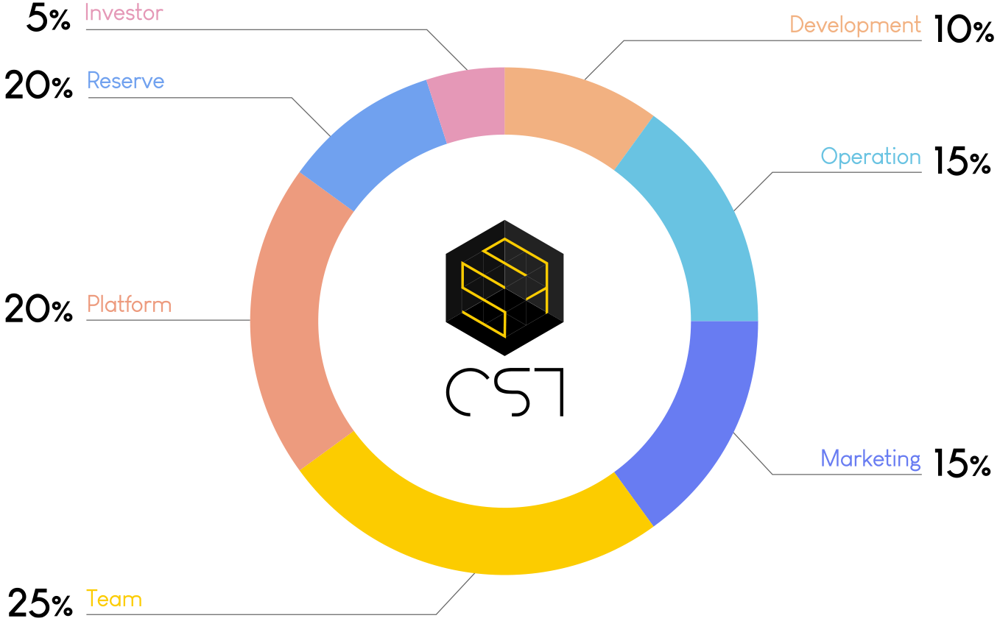

[ Token Distribution Plan ]

  

The Consight team pursues the continued growth of the Consight ecosystem. Marketing, the Consight ecosystem, R&D, and preliminary supplies aim to contribute to the expansion of the Consight ecosystem, and issuance, incineration, and token distribution plans are subject to change if necessary.
  

## **4.5 Use of funds (Use of money)**
The amount raised through token sales and platform revenue will be used to maintain the stable value of CST and expand the ecosystem.  
 
- **Big data rewards and NFT Pool operations**  
  It is used for data acquisition, compensation by user participation, and NFT Pool operation.
  
- **R&D**  
  It is used for research to upgrade projects, such as research on NFT of real estate and merit of holdings and utilization of NFT pools.
  
- **Marketing**  
  It is used for various marketing purposes for project homepages.
  
- **Governance and Partner**  
  It is used by governance and partners in charge of major decision-making and consensus management for Consight.
    
- **Initial distribution**  
  The amount(volume) of being distributed in the ecosystem to operate the platform in the early opening stages.
    
- **Team management**  
  It is used for team operation and development costs, and the quantity is set in lock-up conditions, so the entire volume has been released and operated for a total of two years under the lock-up resolutive conditions.
    
- **Reserve fund**  
  It will be incinerated if it is not used for reserve funds for three years after the operation of the official service at a set cost to prevent disruption to unpredictable operational expenditures. 

   

# **5. Road map**  

    2022 1Q, 2Q – Development and establishment of DB analysis solutions of professional construction companies 
             3Q – CONsVERSE Wallet Mobile App Development
             4Q - CONsVERSE Wallet App Launching (IOS, Android)

    2023 1Q – CONsVERSE Platform – SPACE Development
         2Q - CONsVERSE Platform - Data Market Development
         3Q - CONsVERSE Platform - Model Editor Development
         4Q - CONsVERSE Platform - External system Interface Development

   

# **6. Investor protection system**  

## **6.1 Privacy & Data Protection**
Our company implements users' full consent and data protection policies in the distribution and use of "Consight." It introduces a variety of policies and systems for data protection, including meeting considerable standards for asset protection and privacy, such as compliance with FATF's standards, compliance with the Special Act and the Enforcement Decree, and requesting double authentication when accessing using. 
  

## **6.2 Distribution & Security Policy**
We want to provide a secure and robust security solution to address security errors in the distribution of "Consight." we encourage transparent distribution and use of "Consight." In addition, we want to protect "Consight" holders from fraudulent use, abnormal transactions, and hacking by carefully reviewing the security policies of the exchange requesting the listing of "Consight."
In particular, when using the "Consight" wallet, it controls third parties from accessing the wallet without permission through multi-wallet security, such as offline storage functions, when using the wallet app after running it.
   

# **7. Indemnification & Precautions for Investment**  

## **7.1 Indemnification**  

This white paper does not provide or contain advice on finance, accounting, taxes, laws, and other areas.  
This white paper was written solely to provide information.
The information in this white paper is reliable in its content. Still, there is no guarantee of accuracy or completeness of the information itself, and specific views and opinions may be changed or withdrawn without prior notice.  
Consight Co., Ltd., its executives and employees, agents, and the other party to the relevant contract are not liable for all damages incurred directly or indirectly due to the following reasons:  
Any other damages arising from (1)the use or non-use of the white paper in the event of (2)an error or omission in this white paper, (3)contract content and accuracy and completeness, (4)use or access, or (5)failure to view or copy the white paper due to reasons not responsible for us. Also, Consight Co., Ltd. is not responsible for any of the following:  

(1)Profits, profits, savings, and other economic losses; (2)losses incurred during business transactions, business activities, operating profit-related activities; (3)data losses or damage; (4)incidental or special damages; (5)wasted or lost management hours; (6)indirect or inevitable damages cannot be compensated if given a prior warning or predicted.

  

## **7.2 Precautions for Investment**
 The Consight token-related information in the white paper should not be regarded as interest, purchase, subscription, or sale of investment proposals or other securities. The contents of the white paper do not violate the laws or regulations of the jurisdiction or the relevant country or target specific citizens or individuals and organizations residing in all regions, states, countries, or other jurisdictions where the parties live. You explicitly acknowledge that you have the legal or individual authority to directly find information on issues mentioned or described in the white paper.
All white paper contents are protected by copyright. No white paper may be modified, linked, or used entirely or partially without prior written permission, electronically or otherwise. Individual sections of the white paper can be downloaded or printed only if personal uses or other ownership notices.