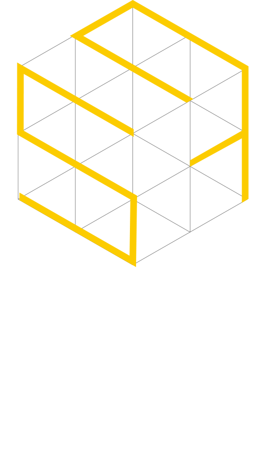
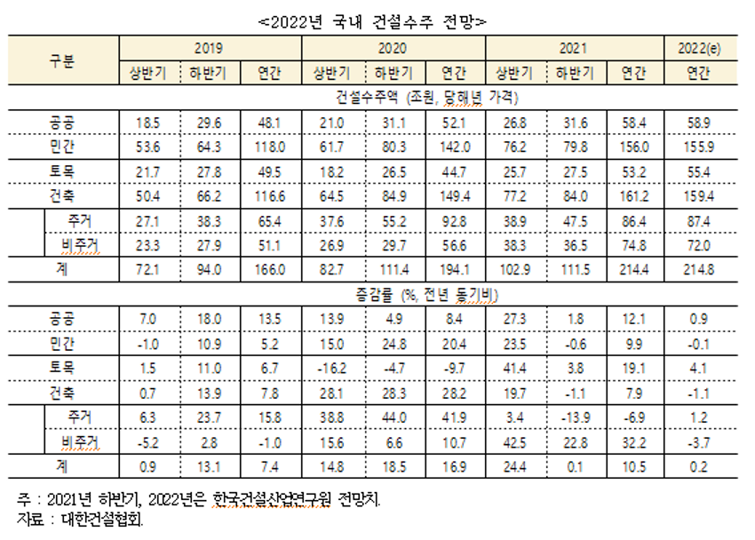
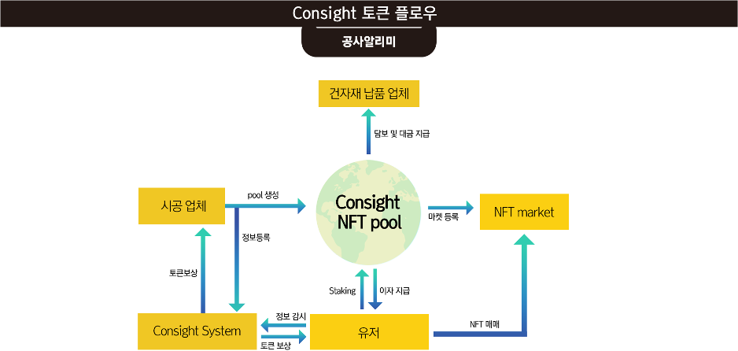
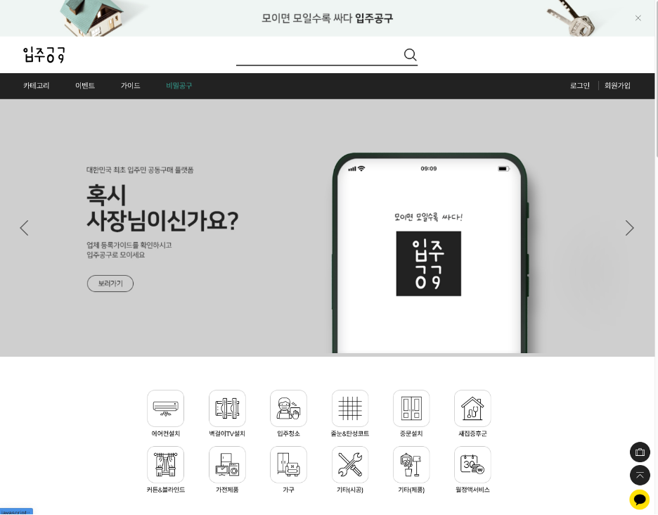
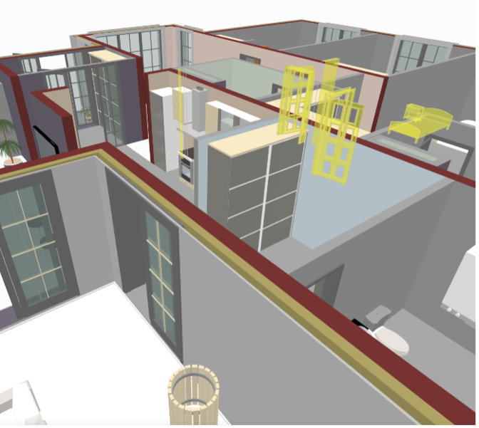
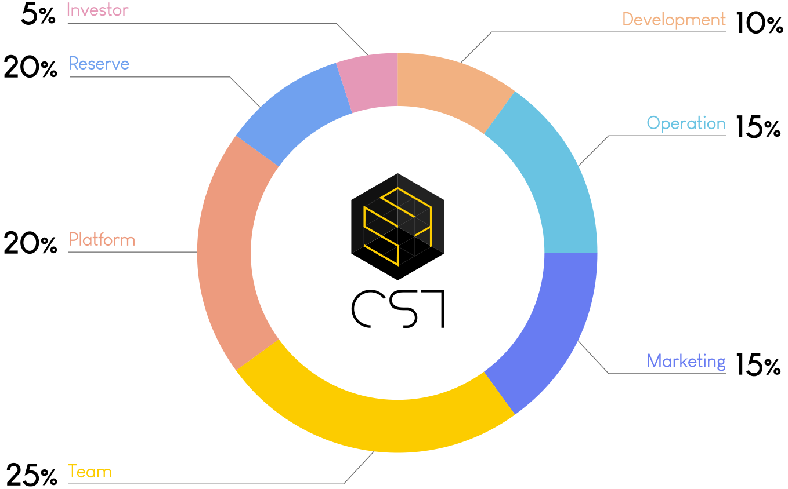

   

   

# **White Paper**

   

# **1. 개요** 
보안분야 및 금융시장 영역에서의 활용으로 대두된 블록체인 기술은 경제영역을 넘어 사회, 문화, 유통영역 등 다양한 산업군에서 활용 및 적용을 시작하였고, 직군 직종을 넘어 국가나 기업간의 영역의 제약없이 해당 산업이 활발히 진행되고 있습니다. 건설 및 자재 유통 등의 영역에서도 블록체인 기술을 통하여 효율적이고 효과적인 운영을 통하여, 불편을 해소하고 새로운 기술의 도입을 통한 관련 산업군의 영역을 확장하고 가치를 상승하는데 기여하고자 합니다.

신용카드의 대중화, 온라인 뱅킹의 확대, 전자 상거래 및 디지털 이코노미의 확장과 블록체인의 활용을 통한 금융권에서의 비약적 발전속도 상승, 언택트(Untact)를 넘어 온택트(Ontact, Online + Untact) 시대로 나아가고 있는 시대의 흐름속에서 교육, 문화, 유통시장의 글로벌 온라인화 등 시장은 진화하고 발전하고 있습니다. 이런 최근의 시장흐름 속에서 블록체인은 빅데이터까지 접하며, 전체 시장에 대한 고도화작업을 탄탄하게 준비하면서 수천억 달러의 매출을 예상하고 있습니다.

반면 국내 건설 영역에서는 그 발전의 속도를 따라가지 못하고 있습니다. 
모든 산업군에서 플랫폼 서비스를 시작으로 블록체인, 빅데이터 등 다양한 서비스가 활발해지고 있음에도 건축 시장에서는 이제 O2O 플랫폼 서비스가 시장에 진입을 준비하려고 하는 등 발전의 속도가 걸음마 단계에 그치고 있다고 해도 과언이 아닙니다.

앞선 산업군의 경우 정보의 사실성 투명성 보안성의 해결을 위해 노력하고 있다면 국내 건설영역에서의 정보는 선의의 여부와 무관 하게 제공자의 정보가 사용자 입장에서 사실여부를 확인하는 것은 어려웠습니다. 사실 여부와 관련없이 제공된 정보를 사용자가 투명하게 받아들이는 것 또한 어려웠습니다. 그만큼 신뢰성에 있어서 다소 부족함이 많았습니다.  
언제든지 정보는 조작이 가능했고 공개를 통제할 수 있었기 때문이었습니다. 이는 보안영역에서도 마찬가지였습니다. 

컨사이트는 건설분야의 원자재 유통 서비스 플랫폼을 시작으로 관련 서비스들을 연계하여 필요한 정보를 하나의 플랫폼 안에서 쉽게 알 수 있도록 제공하고, 블록체인을 통한 데이터의 투명성과 신뢰성을 활용하여 참여자들에게 수요와 공급에 대한 기회를 제공함으로 불필요한 활동 비용을 절감할 수 있도록 하는데 기여하고자 합니다. 또한 독보적인 서비스를 통하여 해당 시장을 선점하고 더 나아가 건설산업군의 비약적인 발전을 도모하고자 합니다.

 
 

# **2. 건설 시장**
 

## **2.1 시장 현황**
국내 건설 수주 시장 중 건축 시장은 2019년 116.6조원, 2020년 149.4조원, 2021년 161.2조원이며  토목 시장의 경우 2019년 49.5조원, 2020년 44.7조원, 2021년 53.2조원으로 매해 지속적으로 증가하고 있으며 지난 11월에 발표된 대한건설협회의 자료에 따르면 2022년도 건설수주 전망도 전년도대비 0.2% 증가한 214.8조원을 기록할 것으로 예상되고 있습니다.  
 

### 2.1.1 건설자재 시장
 

  

  
공공 / 민간 공사의 건설자재 유통은 직접 구매가 약 55.1% 비중으로 나타났으며, 종합건설업체의 경우 발주자가 공급하는 지급자재와 전문업체가 직접 조달하는 마감재 등을 제외하고 구조재 등의 주요 자재에 대해 직접 구매 하는 경우가 많고 전문건설업체는 기본설계와 계획에서 초과 된 자재를 일반적으로 구매 및 조달하였습니다. 가격 협상력이 약한 중소 종합건설업체의 경우 자재비를 하도급에 포함하여 전문건설업체가 직접 구매하도록 하고 있습니다.
  

  

### 2.1.2모바일 상거래 및 O2O 서비스 시장동향  
다양한 분야에서 온/오프라인 상거래에 대해 모바일2.3 모바일 상거래 및 O2O 서비스 시장동향은 플랫폼 환경을 이용하는 추세이며 모바일 상거래 및 플랫폼 서비스 시장규모는 약 8조원 대로 스마트폰의 높은 보급률과 편의성을 통해 모바일 상거래 시장 규모가 지속적인 성장세를 보이며 2020년 4조 7825억원 규모로 성장하였습니다. 온라인과 오프라인을 연결하는 O2O 서비스 시장도 2018년 2조2147억원에서 2020년 3조3179억원 규모로 성장한 것으로 나타났습니다. 건축 시장에서도 다양한 거래 편의환경을 위한 모바일 플랫폼 환경이 요구되고 있으며 해당 환경이 제공된다면 기존의 서비스를 통해 익숙해진 사용자들이 건축관련 상품 및 서비스에 대한 모바일 플랫폼의 참여가 확대될 것으로 전망됩니다.
  

## **2.2 시장전망**
건설수주 시장에서 많은 비중을 차지하고 있는 건축시장에서 건설자재의 직접 공급 유통구조가 점차 늘어나 것으로 전망되나, 아직까지 건자재 시장은 체불문제, 건자재 공급에 대한 새로운 영업환경 문제 등 몇가지 발생한 문제 해결이 필요할 것으로 판단됩니다. 스마트폰 보급 확산과 기술의 발전을 통해 모바일 상거래와 O2O서비스 시장과 블록체인 시장이 급격하게 커지고 있음에 따라 건축시장의 서비스에서도 앞선 문제를 해결할 수 있는 방안이 있을 것으로 판단됩니다. 
   

# **3. Consight(CST) 솔루션**
 

## **3.1 Consight(CST) 개요**  
Consight 생태계는 공사 정보 플랫폼 서비스인 ‘공사알리미’와 입주예정자를 위한 공동구매 사이트인 ‘입주공구’로 구성되어 있습니다. 빅데이터를 활용한 공정 추정 모듈은 공사알리미의 주 고객인 건자재 납품업자로 하여금 영업 비용 감소 및 효율 증진의 효과를 낳으며, 일반인도 플랫폼에 참여할 수 있도록 하여 서비스를 활성화합니다.  
한편, 입주 공동구매 시장의 경우, 독점화 및 정보 불투명의 문제로 인해 입주예정자에게 불리한 시장 환경이 조성되어 있는 상황입니다. Consight는 이러한 문제를 블록체인 기술과 토큰 이코노미를 통해, 서비스 공급자와 이용자 모두에 이익이 될 수 있는 생태계를 구성합니다.
  

## **3.2 공사알리미**  
### 3.2.1 공사알리미 - Consight token(CST)  
공사 정보 플랫폼 서비스인 ‘공사알리미’의 핵심은 데이터 확보에 있습니다. 건축업자의 입장에서는 시공을 맡은 공사 현장 정보 업데이트로 인한 효용이 있어야 하며, 납품업체로서는 해당 정보가 신뢰 가능하여야 하고 정보를 통한 납품 이후 자재 납품 체납 등의 리스크가 제거되어야 합니다. 여기에, 건강한 정보가 꾸준히 업데이트 되기 위해서는 이해 당사자가 아닌 제3자의 데이터 감시도 이뤄질 수 있어야 합니다. 이에, Consight는 CST 토큰 이코노미와 NFT 개념을 도입하여, 문제를 해결합니다.  

Consight 생태계에서 CST 토큰은 기본적으로 유틸리티 토큰으로써, 공사알리미 앱 내 결제에 이용됩니다. 공사 정보를 확인하고자 하는 납품 업체의 경우, CST 토큰을 사용하여 플랫폼을 통해 공사 정보를 확인할 수 있습니다. 또한 건설 자재 대금 결제 및 정산 또한 CST 토큰으로 가능하게 할 예정입니다.
  

<공사 알리미 앱 서비스 사진>

  
Consight 서비스의 기반이 되는 공사 정보 업데이트는 후술하게 될 NFT pool의 등록과 함께 시작됩니다. 공사 정보 등록의 핵심 주체인 건축 업체 혹은 시공 업체는 착수와 함께 NFT pool을 생성할 수 있으며, 플랫폼 내 건물 용도, 용적율, 건폐율, 착공일, 지상 층 수, 연면적 등 기본 공사 정보를 업데이트 할 때마다, 정보 제공의 대가로 플랫폼으로부터 CST 토큰을 지급받게 됩니다. NFT pool 생성 및 공사 정보 업데이트는 일반 유저도 참여할 수 있으며, 일반 유저의 경우 신규 공사 현장 등록 및 정보 업데이트를 통해 플랫폼으로부터 CST 토큰 보상을 획득할 수 있습니다. 만약, 허위로 등록된 공사 정보를 일반 유저가 필터링 할 경우 추가 보상을 획득합니다.
  

<공사 알리미 앱내 CST 토큰 보상 서비스 사진>

  
이와 같은 일반 유저, 건축 업체의 공사 정보 등록과 그에 따른 Consight의 토큰 이코노미는 전국 각지의 공사 현황 정보가 신뢰도 높은 형태로 등록되게끔 하여, Consight 플랫폼이 데이터 확보에 보다 유리한 입지를 차지하게끔 할 것입니다.  
  

<데이터 플로우 구조도>

  

### 3.2.2 공사알리미 - Consight NFT pool  
앞에서 서술한 공사 정보 등록과 그에 따른 보상으로서의 CST가 유틸리티 토큰으로서의 성격을 가지고 있다면, Consight의 NFT pool은 건축 업체가 보다 안정적으로 건설 자재를 수급할 수 있도록 하고, 납품 업체를 건설 자재 비용 체불 등의 리스크로부터 보호하기 위해 도입된 시스템 입니다. 또한 여기에 일반 유저는 CST 토큰으로 NFT pool에 참가함으로써 건설 자재의 안정적인 수급에 기여하는 대가로 일정 수준의 이자를 획득할 수 있습니다. 
  

<공사알리미 - 앱 내 현장지도/가상 건물 표기>

  
먼저 건축업자의 경우, CST 토큰을 소모하여 시공중인 건물을 NFT pool로 등록 및 플랫폼 내 가상의 건설 현장을 설립할 수 있습니다. NFT pool은 건설 자재의 원활한 수급 및 조달을 위해 설립되며, 건축이 완료되는 시점까지 유지됩니다.  NFT pool은 CST 토큰을 보유중인 누구나 참여 가능하며, 참가자는 NFT pool 생성시 등록된 이자율에 따라 완공과 함께 CST 토큰을 지급받게 됩니다.  

건축업자는 시공중인 건물을 NFT pool로 형성하여 공개함으로써, 건설 자재 비용 조달의 부담을 덜 수 있으며, 건설자재 납품업자의 경우 NFT pool에 예치된 CST 토큰을 일종의 담보로 받아들여 보다 안정적인 구조 속에서 자재를 납품하여 체납 등의 리스크로부터 자신을 방어할 수 있게 됩니다. 
건설 완료와 함께 NFT pool은 종료되며, pool에 참가한 유저들에게는 고지된 이자율에 따라 CST 이자가 지급됩니다.NFT 종료와 함께 해당 건물은 NFT 마켓에 등록되며, 등록된 NFT는 CST를 통해 거래 가능합니다.
  

## **3.3 입주공구**  
Consight생태계의 또 다른 서비스인 ‘입주공구’는 입주 아파트 공동 구매 플랫폼 구성을 목표로 합니다. 아파트 입주 시 벽걸이 TV, 에어컨, 인터넷, 입주 청소 등 기본적으로 필요한 물품 및 서비스가 있으며, 현재 국내에 이러한 정보를 효율적으로 제공하는 플랫폼이 부재한 상황입니다. 실제로 입주 박람회를 통해 공동구매를 진행할 경우 오히려 더 비싼 값에 구매를 하게 되는 경우도 있어, 입주공구  플랫폼은 현 시장의 문제를 해결할 수 있는 서비스라고 할 수 있습니다.
  

<입주 공구 사이트>

   

<입주 공구 상세페이지>

  
CST 토큰은 입주공구 플랫폼내 메타버스 세계관인 ‘ CONsVERSE (Consight Metaverse)’에서 이용됩니다.
  

### 3.3.1  CONsVERSE (Consight Metaverse)
CONsVERSE Platform은 블록체인 기술을 활용한 NFT 기술 기반의 메타버스 플랫폼 입니다. CONsVERSE는 다양한 아파트 및 지역 커뮤니티를 위한 메타버스 플랫폼으로써 입주초기 예비입주자들을 위한 네이버 카페, 입주 이후 카카오톡 단톡방, 네이버 밴드 등으로 나뉘는 커뮤니티를 보다 직관적으로 체계적으로 구축하여 보다 쉽고 편리하게 입주민들이 소통할 수 있는 공간을 제공하는데 목적이 있습니다.

플랫폼 참여자들은 플랫폼내에서 다양한 활동을 통하여 보상을 획득할 수 있으며, 참여자들의 활동 및 기여도에 따라서 공정한 보상이 분배되도록 시스템이 운영됩니다. 플랫폼은 다양한 디바이스로 메타버스 환경(PC, 모바일 기기, VR기기 등)에 참여할 수 있으며, 기본적으로는 PC의 웹 브라우저를 이용합니다. 부가적 디바이스인 VR장비를 활용하면 더욱 현실성 있는 메타버스 환경을 경험할 수 있습니다. 커뮤니티 참여자들에게는 실측에 기반한 3D 공간을 제공함으로써 보다 사실적이고 현실적인 공간을 제공합니다. CONsVERSE Platform은 4가지 솔루션으로 구성되어 있으며, 구성은 아래와 같습니다.

#### 3.3.1.1 스페이스
CONsVERSE에 처음 접속한 참여자들이 가장 처음 보게 되는 가장 기본이 되는 공간 입니다. 스페이스 공간에 참여한 참여자들은 다른 참여자들과 채팅 또는 화상 채팅을 통하여 서로 소통할 수 있으며, 자료 참여자들의 가입정보를 활용하여 그룹을 나누며 각 그룹에 맞는 기본적인 입주 커뮤니티 공간이 제공됩니다. 입주 커뮤니티 공간은 기본적인 채팅, 화상채팅 및 게시판 기능을 포함하고 있으며 각 커뮤니티내의 참여자들과 다양한 소통을 하도록 지원하게 됩니다.

* 입주 커뮤니티 스페이스 제공  
    기본적으로 제공되는 커뮤니티 공간입니다. 참여자(입주자)들이 처음 이동되는 공간입니다. 해당 공간에서 다른 참여자들과  채팅, 화상채팅 등을 이용하여 서로 소통할 수 있습니다.

* 모델 하우스  
    다양한 아파트의 3D 모델링 데이터를 이용하여 자신만의 모델하우스를 꾸밀수 있는 공간입니다. 플랫폼에 참여하는 참여자들(기업 및 개인)은 모델 에디터툴을 이용하여 다양한 조건의 아파트 모델하우스를 제작할 수 있습니다. 제작한 모델하우스는 콘텐츠는 제작자들의 콘텐츠 공개 레벨에 따라 다양하게 공개될 수 있습니다. 높은 모델하우스 콘텐츠의 퀄리티를 원하는 구매자(기업)들은 모델하우스 콘텐츠를 직접 확인하고 마음에 드는 콘텐츠를 직접 구매하여 모든 참여자들에게 공개할 수 있습니다.
 

<모델하우스 이미지>

  

* 투표  
    주 커뮤니티에서는 커뮤니티 공간에서 발생하는 다양한 의견 및 합의점을 찾기 위해 투표를 진행하고 있으며, 카페 게시판이나 카카오톡을 이용한  투표 시스템을 도입하고 있는 추세 입니다. CONsVERSE는 이렇게 꼭 필요한 커뮤니티내의 투표 시스템을 블록체인 기술을 도입하여  투표에 적용합니다. 아래와 같은 일반적인 투표 기능에 대해서 사용할 수 있습니다.

      - 입주민이 모두 찬성하지 않은 도색공사, 용역업체 변경, 입주민대표 선출,해임 등
    투명하지 않고 불편한 기존의 투표 시스템을 CONsVERSE내에서 사용 및 접근하기 쉽게 구현될 예정입니다. 또한 투표에 대한 보상으로 CST를 지급함으로써 입주민들의 투표 참여를 독려합니다. 모든 투표는 블록첸의 기술로 여러가지 블록체인 플랫폼에 기록될 수 있으며 해당 기능을 이용하여 위변조가 불가능합니다.  
* 게시판  
    입주 커뮤니티 스페이스에서는 다양한 주제의 커뮤니티 게시판을 제공합니다. 참여자들은 스페이스내에 게시판이 있는 곳에 접근하거나 UI를 이용하여 모든 게시판의 내용을 확인하거나 다양한 주제의 콘텐츠를 직접 게시 할 수 있습니다. 다양한 주제의 콘텐츠들을 언제든지 확인할 수 있으며 가치 있는 콘텐츠를 직접 후원 및 추천할 수 있습니다. 커뮤니티 게시판은 다양한 그룹별 또는 고유 입주 커뮤니티별 게시판이 제공될 예정입니다.

      - 다양한 주제의 커뮤니티 게시판 제공
      - 편리한 UI로 쉬운 콘텐츠 확인
      - 직접적인 게시판 콘텐츠 생산
      - 콘텐츠 추천 및 후원 시스템

* 광고  
    광고 기능은 다양한 그룹들이 생성한 입주 스페이스 가상 공간안에 기업체 또는 개인의 광고를 게시 및 송출할 수 있습니다. 향후 제공되는 다양한 광고 설정 및 입찰을 통하여 공간 및 시간별 광고를 게시 송출하게 됩니다. 광고 송출에 대한 일부 수익은 각 입주 커뮤니티 그룹의 공동 자산으로 분배됩니다.  
    광고의 방식은 1) 단순노출형, 2) 퀘스트보상형 으로 나누어집니다.  
    입주 커뮤니티 참여자 대상으로 광고예정인 기업(소상공인 포함) 및 개인은 CST를 이용하여  업종별 효과적인 광고를 진행할 수 있습니다.  

    1. 단순 노출형 광고  
       - 단순형 노출광고는 각 입주 커뮤니티 스페이스의 다양한 공간에 일정시간동안 표출되는 광고 방식을 의미합니다. 다양한 시간대 및 총 광고 노출시간 등을 선택하여 보다 효과적인 광고를 진행할 수 있도록 지원합니다.  
    2. 퀘스트 보상형 광고  
        - 일반적인 공간 광고 노출이 아니라, 팝업 또는 퀘스트형식의 알람을 통하여 메타버스 플랫폼의 참여자들에게 직접적인 참여를 유도하는 광고 방식입니다. 주로 설문 조사 및 고객들은 간단한 의견을 수집하는 광고 방식으로 더욱 신뢰도 높은 데이터와 광고 효과를 가집니다.
  

#### 3.3.1.2 데이터 마켓 (Modeling Market)

데이터 마켓은 참여자들이 제작한 3D 모델링 데이터를 판매 및 임대하는 데이터 마켓입니다. 모든 참여자들은 3D 모델링 제작자로 참여할 수 있으며 해당 서비스를 이용하여 직접 제작한 모델링 데이터를 Consight Metaverse에서 사용할 수 있습니다. 또한 자신이 제작한 데이터를 다른 참여자들에게 판매 및 임대할 수 있으며 해당 모델링 데이터들은 모두 NFT(Non-Fungible Token) 기술을 활용하여 콘텐츠의 가치와 소유권을 보호하게 됩니다.  
 
* 3D 모델 판매 및 임대  
  모델러(참여자 : 개인 또는 기업)는 제품 모델링 데이터를 데이터 마켓에 등록해 판매 혹은 임대 할 수 있습니다.

* 광고 입찰 서비스  
  커뮤니티 스페이스 또는 가상 모델하우스에 송출되는 광고 입찰 시스템입니다. 게시기간은 최소 1일이며, 최대 30일까지 가능합니다. 입찰은 게시 1일에 소요되는 CST의 개수가 가장 많은 순으로 낙찰되며, 낙찰 이후 무단 포기시에는 최대 6개월간 입찰자격이 제한됩니다.  
 

#### 3.3.1.3 Model Editor  
모델러(참여자 : 개인 또는 기업)는 Consight Metaverse Platform내 기본 Model Editor를 이용하여 모델하우스 제작 및 편집이 가능합니다.

#### 3.3.1.4 External System Interface  
외부 시스템의 데이터를 연동하기 위한 인터페이스 시스템, 부동산 데이터 또는 지도 정보등의 데이터를 가져와 연동하기 위한 시스템 입니다.

      - 부동산시세 : 국토교통부 실거래가 공개시스템 ( [rt.molit.go.kr](http://rt.molit.go.kr/) )
  

### 3.3.2 플랫폼 역할  

#### 3.3.1.3 가상 입주 박람회  

가상 입주박람회 개설로써 입주민들이 장소에 구애 받지 않고 편하게 업체들과 만날 수 있는 공간을 마련합니다. 업체는 CST를 구매하여 입주박람회장 내 여러 형태의 부스 및 광고장치들을 제작합니다. 입주박람회 참석 및 부스 방문, 광고장치들을 확인할 때마다 입주민들은 CST를 획득 하게 되며, 실 제품의 판매는 입주공구 사이트로 연동됩니다.
  

  

#### 3.3.1.4 커뮤니티 공간  
검증되지 않은 무분별한 인원구성으로 적극적인 참여가 어려운 카페, 단톡방과는 달리 좀더 활동적인 아파트내 목적(관계)형 커뮤니티를 생성합니다. 입주민이 자신의 프로필(직업, 성별, 나이, 전문분야 등)을 기록하고 대화를 원하는 상대방의 프로필을 확인하거나, 채팅을 시도할때 CST를 소진하게 됩니다.  
 

   

# **4. 토큰**
 

## **4.1 토큰 개요**
CST는 이더리움블록체인 상에서 설계된 이더리움 기반 토큰으로, Consight 플랫폼(공사알리미, 입주 공구) 내에서 지불 결제를 위한 유틸리티 토큰, NFT pool 참가, CONsVERSE (Consight Metaverse) 활성화를 위해 사용됩니다. 단순한 지불 결제보다는 Consight의 서비스 생태계를 활성화 하는 데 주 목적을 두고 있습니다.  
이더리움은 현재 NFT와 De-fi 등 전체 암호화폐 생태계에서 핵심 기능을 수행하고 있기에 플랫폼의 확장성을 고려하여 채택 되었습니다. NFT와 Staking pool 모듈 등 Consight의 전체 로드맵에 있어 장기적인 비전에서 이더리움을 기반으로 하는 것이 가장 효율적인 선택이 될 것입니다.  
  

## **4.2 토큰 기능**
CST의 주된 기능은 단연 Consight 플랫폼 내 다양한 서비스 및 물품 구매에의 교환 수단으로서의 역할입니다. 전국 각지의 공사 정보를 확인하거나, 건설 자재 대금을 지불,  CONsVERSE (Consight Metaverse) 서비스 이용 등 Consight의 플랫폼 내 서비스 결제의 핵심 역할을 맡고 있습니다.   
더불어, 일반 유저는 공사알리미나 입주 공구 서비스 내 정보 등록 및 필터링을 하며 CST를 획득할 수 있고, 획득한 CST 토큰을 통해 NFT pool 참여 혹은 플랫폼 서비스를 이용할 수 있습니다.  
 

[CST Token Flow]

  

## **4.3 토큰 가치**  
Consight는 다음과 같은 방향으로 CST 토큰의 수요를 증가시키고 가치를 지속적으로 유지하기 위해 다음과 같은 전략을 제시합니다.   
 

### 4.3.1 NFT 마켓
Consight는 건설이 완료된 건물을 NFT화하여 마켓운영을 도입할 예정입니다. 앞으로 NFT 보유자에게 해당 건물과 입주 업체에서 제공되는 서비스 할인 등 NFT를 통해 다양한 베네핏을 제공하여 그 가치를 높이는 데 주력할 계획입니다. 건물 기반 NFT와 그를 중심으로 한 부가 혜택이 확장될수록 NFT 유저 증가 및 마켓이 활성화할 것으로 예상됩니다.  

### 4.3.2 Consight NFT pool  
Consight NFT pool은 건설 자재 확보에 어려움을 겪는 시공 업체와 대금 체납 등 위험 요소를 가지고 있는 납품 업체의 리스크를 줄이고자 기획되었습니다. 시공 업체가 NFT pool을 생성하면, 유저들은 해당 업체가 설정한 이자율을 확인 후 해당 pool에 CST 토큰을 예치할 수 있습니다. 납품 업체는 NFT pool에 예치된 금액을 일종의 담보금 성격으로 받아들일 수 있습니다. Consight는 이와 같은 NFT pool이 유저 - 시공 업체 - 납품 업체가 서로 윈윈할 수 있는 시스템으로 자리 잡을 것으로 믿습니다.  

### 4.3.3 ConsightMetaverse Platform  

입주공구 내  CONsVERSE (Consight Metaverse)에서 CST는  
    
    1. 데이터 마켓(모델링)의 거래  
    2. 투표의 보상  
    3. 게시판 운영 (개설,게시물 등록 삭제 등)  
    4. 스페이스 내 광고 게시 및 노출 보상  
    5. 가상 입주 박람회 부스 및 장치 제작  
    6. 커뮤니티 내 이벤트 (프로필 확인,채팅 등)  
등에 활용됩니다. 플랫폼이 활성화됨에 따라 CST의 수요는 커갈 것이며, 이러한 구조는 CST의 지속적인 가치 상승 및 유지 방안 중 하나 입니다.  
  

## **4.4 토큰 분배**  
Consight는 총 100억 개의 CST를 발행합니다. 그 외 추가 토큰 발행은 없으며, 분배 계획은 아래와 같습니다.
  

<토큰 분배 계획>

  

Consight 팀은 Consight 생태계의 지속적인 성장을 추구합니다. 마케팅, Consight 생태계, R&D, 예비 물량 등은 모두 Consight 생태계 확장에 기여하기 위해 사용하는 것을 목표로 하고 있으며, 필요시 발행과 소각, 토큰 분배계획은 변경될 수 있습니다.
  

## **4.5 자금 사용처**
토큰세일과 플랫폼 수익을 통해 모집된 금액은 CST의 안정적인 가치 유지와 생태계 확장에 사용될 예정 입니다.  
- **빅데이터 보상 및 NFT Pool 운영**  
  데이터 확보,이용자들의 참여에 의한 보상및 NFT Pool 운영에 이용됩니다.  
- **R&D**  
  부동산의 NFT화 및 보유 메리트 등에 대한 연구, NFT pool의 활용방안 등 프로젝트의 고도화를 위한 연구에 활용될 목적으로 사용됩니다.  
- **마케팅**  
  프로젝트 홈보를 위해 다양한 마케팅을 위한 활용목적으로 사용됩니다.  
- **거버넌스 및 파트너**  
  Consight에 대한 주요의사 결정과 합의노드 운영을 맡는거버넌스 및 파트너 사에 활용됩니다.  
- **초기 유통**  
  오픈초기 플랫폼 운영 등을 위한 목적으로 생태계에 유통되는 물량입니다.  
- **팀운영**  
  팀운영 및 개발 비용으로 활용되며,해당 물량은 락업 조건이 설정되어있어,총 2년간 전체 물량이 락업해제조건에 의해 해제되어 운영 됩니다.  
- **예비비**  
  미리 예측할 수 없는 운영상의 지출에 차질이 발생하지 않도록 설정된 비용으로 공식 서비스 운영 후 3년동안 예비비에 활용이 발생하지 않을시 소각처리 됩니다.  

   

# **5. 로드맵**  

    2022 1Q, 2Q – 전문건설업체 DB 분석솔루션 개발 구축  
             3Q – CONsVERSE Wallet 모바일 앱 개발  
             4Q - CONsVERSE Wallet 앱 런칭(IOS, Android)  

    2023 1Q – CONsVERSE Platform - SPACE개발 
         2Q - CONsVERSE Platform - Data Market개발  
         3Q - CONsVERSE Platform - Model Editor개발  
         4Q - CONsVERSE Platform - External system Interface개발  

   

# **6. 투자자 보호장치**  

## **6.1 개인 정보 및 데이터 보호**
자사는 “Consight”의 유통 및 이용에 있어 이용자의 완전 동의 및 데이터 보호 정책을 시행합니다. FATF의 기준안 준수, 특금법 및 동 시행령 준수 등 자산 보호 및 개인 정보 보호를 위한 상당한 기준을 충족하고, 접근, 이용시이중인증을 요청하는 등 데이터 보호를 위한 다양한 정책과 시스템을 도입합니다.  
 

## **6.2 유통 및 보안 정책**
자사는 “Consight”의 투명한 유통 및 이용을 장려합니다. 또한, 자사는 “Consight”의 상장을 요청하는 거래소의 보안 정책 등을 면밀히 검토한 후 상장 여부를 결정함으로써 부정이용, 이상 거래, 해킹 등으로부터 ”Consight” 보유자를 보호하고자 합니다. 자사는 “Consight” 유통시 발생할 수 있는 보안 오류를 해소하기 위해 안전하고 견고한 보안 솔루션을 제공하고자 합니다. 특히 “Consight” 지갑 이용에 있어서 지갑 앱 실행 후 이용시 저장소 오프라인 기능 등 다중 지갑 보안 보안을 통해 지갑에 대한 제3자의 무단 접근을 제어합니다.  
   

# **7. 면책사항 및 투자 유의사항**  

## **7.1 면책사항**  

본 백서는 재무, 회계, 조세, 법률 기타 분야에 대한 조언을 나타내거나 내포하고 있지 않습니다.  
본 백서는 오로지 정보 제공의 목적으로만 작성되었습니다.  
본 백서상의 정보는 그 내용에 대해 신뢰성을 갖고 있지만, 정보 자체에 대한 정확성이나 완전성에 대한 보증은 없으며 특정 견해 및 의견은 사전 통지 없이 변경, 철회될 수 있습니다.  
주식회사 컨사이트 및 그 임직원, 에이전트, 관련 계약 상대방은 다음 각 호를 사유로 직, 간접적으로 발생하는 모든 손해를 책임 지지 않습니다.  
본 백서상 (1)오류 또는 누락, (2)계약 내용 및 정확성 및 완전성, (3)사용 또는 접근 및 (4)당사의 책임없는 원인으로 백서를 열람 또는 등사하지 못한 경우, (5) 백서 사용 또는 미사용으로 인해 발생하는 기타 모든 손해. 또한, 주식회사 컨사이트는 다음 사항들에 대하여 그 어떤 책임도 부담하지 않습니다.  
(1) 이익, 수익, 저축 및 기타 경제적 손실; (2) 사업 거래, 사업 활동, 영업 이익 관련 활동 중에 발생한 손실; (3) 데이터 손실 또는 손상; (4) 부수적 또는 특수 손해; (5) 낭비되거나 손실된 관리 시간; (6) 간접적이거나 필연적인 손해는 사전 경고가 주어졌거나 해당 손해가 예측 가능할 경우에도 보상 받을 수 없습니다.  
  

## **7.2 투자 유의사항**
해당 백서에 포함된 Consight token 관련 정보는 투자 제안 또는 다른 유가 증권의 이자, 매수, 청약, 판매로 간주해서는 안 됩니다. 해당 백서의 내용이 관할 및 관련 국가의 법률 내지 규정에 위배되거나 당사 또는 당사자가 거주하는 모든 지역, 주, 국가, 기타 관할권에 거주하는 특정 시민 또는 거주자 개인 및 단체를 대상으로 하지 않습니다. 귀하는 백서에 언급되거나 설명된 문제에 대한 정보를 직접 찾아야 하는 법적 또는 개인의 권한이 있음을 명시적으로 인정합니다.  
모든 백서 내용은 저작권의 보호를 받습니다. 개인적 용도 또는 기타 소유권 고지 사항이 있는 경우에만 백서의 개별 섹션을 다운로드하거나 인쇄할 수 있습니다. 사전의 서면 허가 없이는 전체적으로 또는 부분적으로 복제하거나 전자적 수단 또는 기타 방식으로 복제하거나, 공공 또는 상업적 목적으로 백서를 수정, 링크, 사용할 수 없습니다.